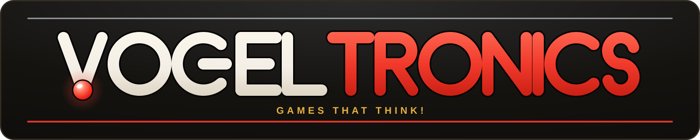
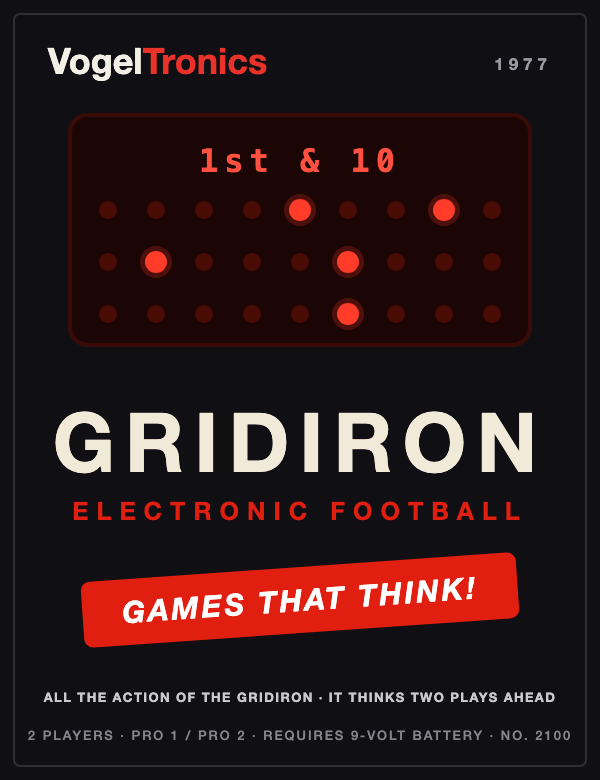

  

<h1 align="center">GRIDIRON — Electronic Football (1977)</h1>

<strong>A solo, keyboard-first web recreation · Gridiron 1, running only · No. 2100</strong>

  

**Gridiron** is a browser recreation of VogelTronics' 1977 red-LED handheld football game: one bright blip against five dimmer tacklers on a 3×9 field, four downs to move the chains, a kick on fourth down, and a defense that reacts 50% faster on PRO 2. It is part of the fictional **[VogelTronics](https://vogeltronics.metaincognita.com)** universe ("Games That Think!") — Elk Grove Village's most heartbreaking toy company.

The 1977 original was a two-player game (that's what the box says, and boxes never lie); this recreation adapts it for **solo play** — you run the offense, the computer rushes the defense.

> **Status: spec complete — build pending.** The manual-verified spec and the self-contained build prompt live in [`docs/gridiron-spec-and-prompt.md`](docs/gridiron-spec-and-prompt.md). A separate future project, **Gridiron II**, will reuse this engine and add THE FORWARD PASS — it says so right on the box.

## Planned controls (keyboard-first)

The game will be **100% playable from the keyboard** — the on-screen keys mirror the keyboard, never replace it.

| Action | Keys |
|---|---|
| Run toward goal | **D** or **→** |
| Lane up / down | **W** / **S** (or **↑** / **↓**) |
| Status readout (ST) | **T** |
| Score readout (SC) | **C** |
| Kick (4th down only) | **K** or **Space** |
| Power / skill | **0** = OFF · **1** = PRO 1 · **2** = PRO 2 |
| Mute | **M** |
| Blip style (dash / round) | **B** |

## Planned stack

Vite + TypeScript (vanilla, no framework) · SVG cabinet + LED field · Web Audio oscillators (no audio files) · seeded RNG · Vitest · Netlify static deploy.

## Repo assets

- `docs/images/gridiron-boxart.{png,svg}` — the 1977 box art, extracted from the [vogeltronics-history](https://github.com/cschweda/vogeltronics-history) page
- `docs/images/vogeltronics-logo.svg` — the VogelTronics wordmark
- `docs/images/og-image.png` — the social card, generated by `tools/make-og-image.py`; the script is **reusable for every VogelTronics game** (`--boxart`, `--title`, `--subtitle`) so the whole catalog shares one look

## The VogelTronics universe

- **[The whole story](https://vogeltronics.metaincognita.com)** — the corporate history, 1961–1983 ([repo](https://github.com/cschweda/vogeltronics-history))
- **[vogel-vox](https://github.com/cschweda/vogeltronics-vogel-vox)** — the voice synthesis behind Rovacon
- **[MetaIncognita](https://metaincognita.com)** — where the playable catalog lives

## Disclaimer

Gridiron is an original, independent work created as an **affectionate homage** to the 1977 Mattel Electronics Football handheld. It is **not affiliated with, endorsed by, sponsored by, or connected to Mattel, Inc.** in any way. No trademarks, logos, brand names, product names, artwork, code, ROMs, or other material from Mattel or the original product are used or reproduced. "VogelTronics," "Gridiron," and all associated names, logos, casing, and copy are wholly fictional and original. The original instruction manual was consulted **only to understand and recreate gameplay rules and feel**; game rules and mechanics themselves are not protected by copyright. "Mattel" and "Mattel Electronics Football" are referenced solely for descriptive and historical purposes and remain the property of their respective owner.

## License

MIT © 2026 Chris Schweda
